#  Fundamentals of Cloud Computing & Web development on Azure 👨‍💻

## Are you a Cloud enthusiast ✨ or a Web enthusiast ?? Want to know the fundamentals of cloud ??
## If Yes , then here is the overview.
 
### _What is cloud computing??

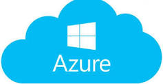

  
 

 
 Cloud computing is the on-demand availability of computer system resources, especially data storage and computing power, without direct active management by the user. 
 
 

  
            

   When you turn on a bulb you don't want to bother about the things happening in the backend of it i.e the passing of currents, wires in the circuit and other things . __Similarly storing data, streaming video, or even hosting a website all require managing hardware and software.Luckily we have cloud to manage all this for us__
   
 
 __Services of cloud:__
 <ol>
 <li>Computer Power: Servers, VMs</li>
 <li>Storage:databases</li>
 <li>Networking: secure connections</li>
 <li>Analytics: such as visualizing telemetry and performance data</li>
</ol>
 
We will be teaching you the basics of the  __cloud computing , Microsoft Azure and hosting a Web application on Microsoft Azure.__

Also it will help you in getting your own __personal Website__ , use it for your Project or may be your personal branding.

## What is Azure??
Microsoft Azure is a flexible, scalable, and full-featured cloud platform. Python, JavaScript, Java, .NET - you can run them all on Azure!
<ul>
 <li>*Host your website</li>
 <li>*Create your ML model</li>
 <li>*Work on AI through cognitive services</li>
 <li>*use powerful Data Science Virtual machines</li>
 <li>*Azure API’s </li>
 <li>*Azure Kubernetes services</li>
 <li>* Work on IOT</li>
</ul>
You name it and you can do it in Azure It provides all the three services i.e IAAS,PAAS,SAAS

## Redeeming the Azure Voucher codes:
__steps to followed__
__Go to https://azure.microsoft.com/en-in/free/students/__
 
<ol>
 <li>Click on Sign-In in the top right corner.</li>
<li>If already have an account then skip this step, otherwise, click on create a new. (Feel free to use Gmail/outlook/other accounts).</li>
 <li>Create a new account with just a username and password.</li>
 <li>Click on the activate now button on the page.</li>
<li>Use the drop-down in the verification method to verification code, enter the voucher code (25 DIGIT) shown here below.Voucher Code:  Do not share your specific code with someone as this is exclusive to you. And everyone registered before will get his/her own.</li>
<li>Enter Specific details (PAN is optional, Type University name as XYZ university, and Phone number).</li>
 <li>Once done, you will be redirected to the Azure portal, your benefits will be activated.</li>
 <li>This is it, for now, further information will be sent through the mail.</li>

 </ol>

# DEPLYOING A WEB APP IN AZURE:

Steps:

1> __Go to the Azure Portal__
 
 

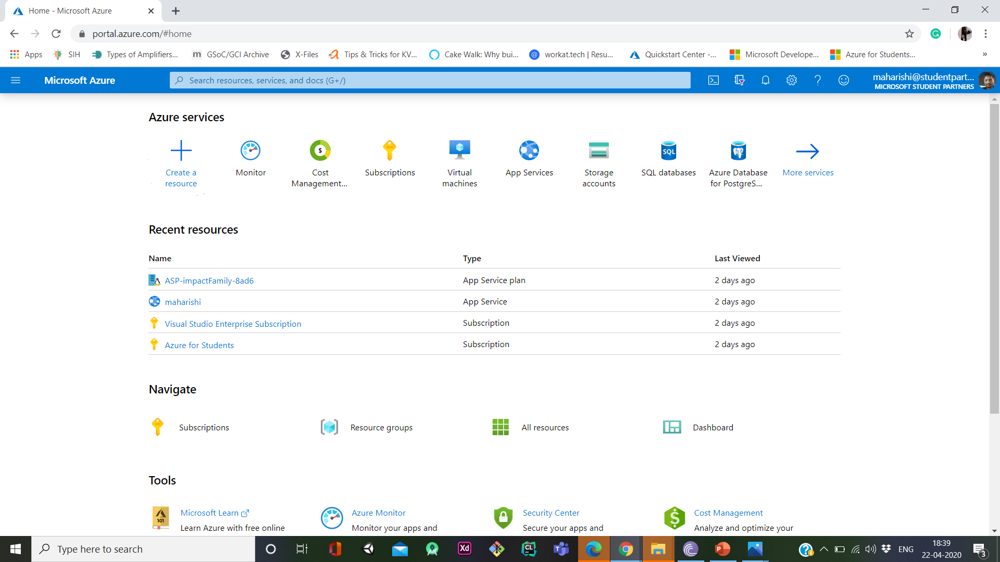

  

 
 
2>__Click on Create Resource__
 
   

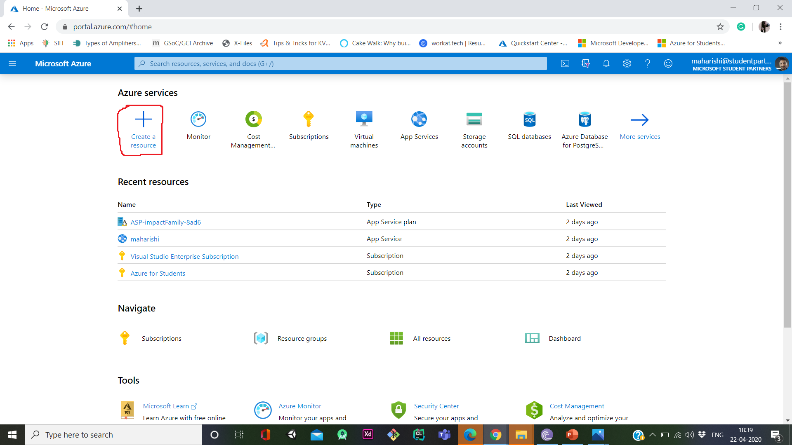

  

3>__Click on web app__
 
  

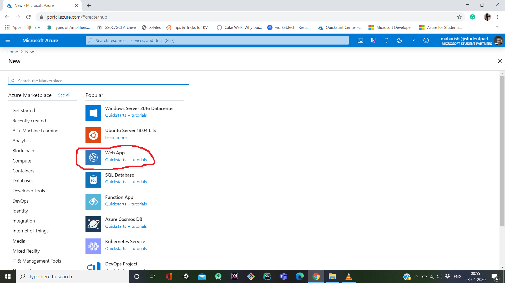

  

4.>You will be directed to this page, fill the Requisites Check out the plan and other requirments according to your app and click on create .
 

  

5.>Check all the options and then click on Review and create
 

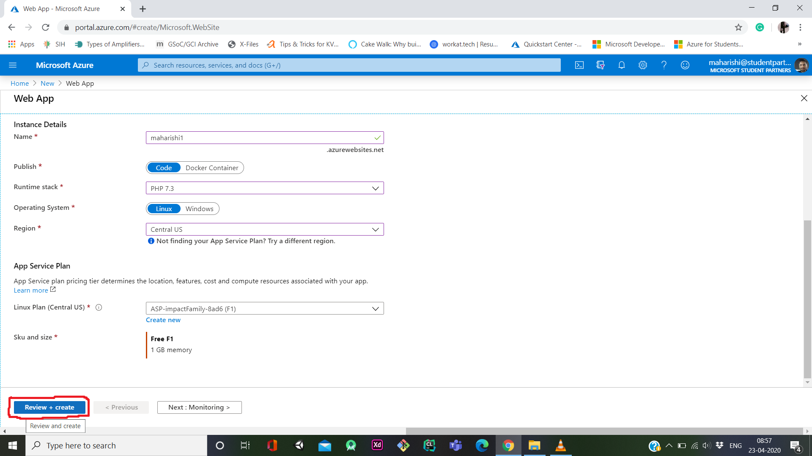

  

6.> __Check this notification__ 
 

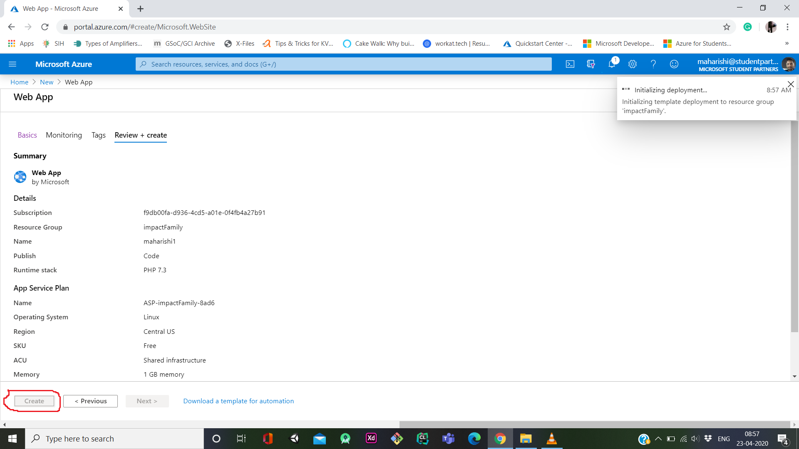

  

6.> __click on go to resource__ 
 

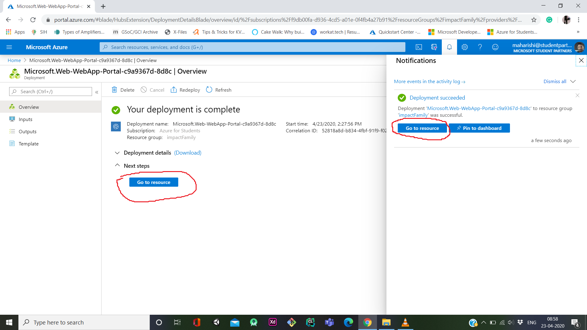

  

7.>you will directed to this window
 

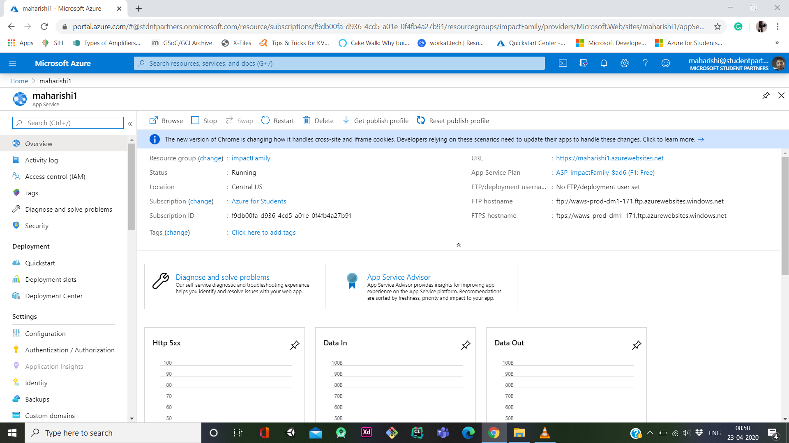

  

8.>click on the deplyoment centre and then click Git-Hub.
 

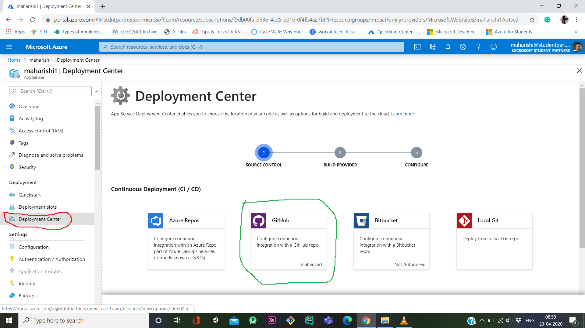

  

9.> add your Git-Hub accound , select the repository and then deploy the code.

9.1.> __next step__ 
 

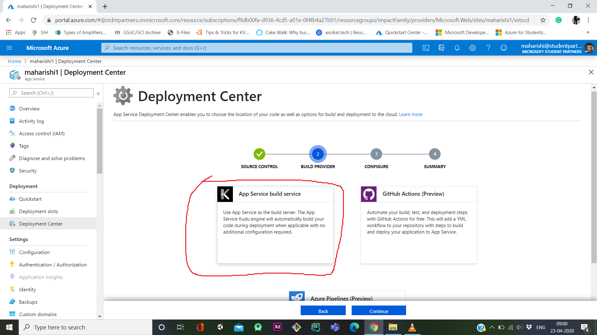

  

9.2.> __next step__ 
 

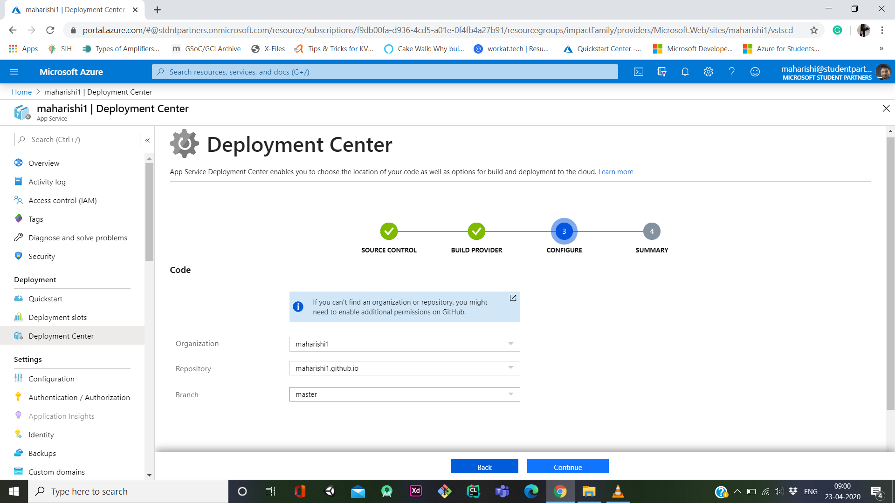

  

9.3.> __click on Browse__ 
 

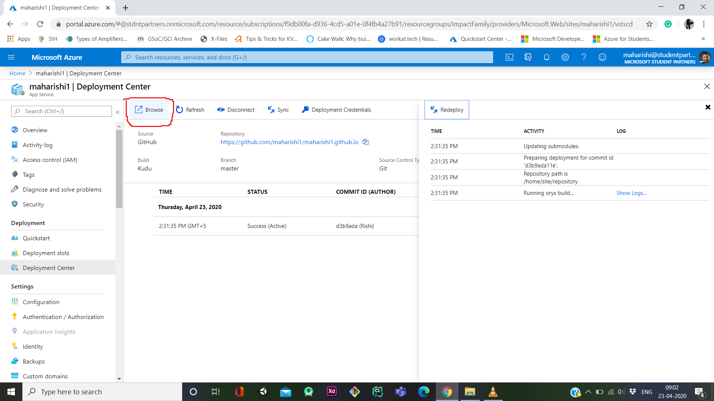

  
10.>check your website 

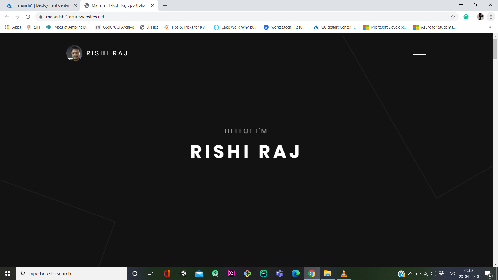

  
 

Thanx guys for giving a read!!

 
# This Repo is maintained by Rishi Raj
 

  
 

________________________________________________________________________________________________________________________________________

__Useful resouces for the session__ 👨‍🏫 :
<ul>
  <li>  ▶ https://docs.microsoft.com/en-gb/learn/paths/azure-fundamentals/ </li>
  <li>  ▶https://docs.microsoft.com/en-us/azure/app-service/app-service-web-get-started-html</li>
  <li>▶https://docs.microsoft.com/learn/paths/deploy-a-website-with-azure-app-service/</li>
 </ul> 

